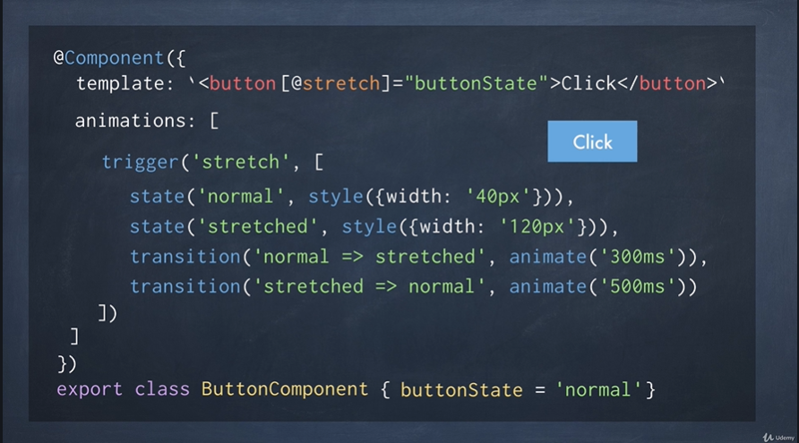

# Animações

Traz movimento a uma aplicação e o angular tem um módulo especifico para elas, que é baseada em uma spec chamada WEB ANIMATIONS API. Deve ser importada usando o @angula/animations

Como usar ...

