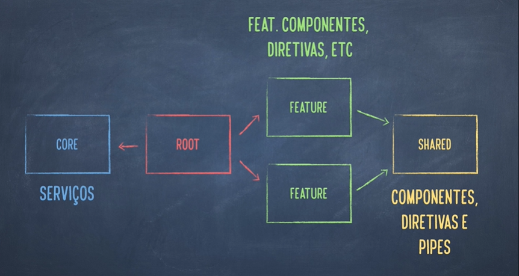

# O que são módulos em angular?

São itens de configurações do framework que servem para agregar componentes, serviços, diretivas ou pipes. Mas não so com o objetivo de organizar o código mas também decidir o que sera exportado para fora do modulo. Além disso ah coisa como dividir a aplicação em partes indepentes e definir que essas partes não sejam carregadas de imediato, apenas quando requisitada (chamado de lazy loading).

### Os tipos de módulos que podemos ter

  *   Módulo Raiz (ROOT MODULE)
  *   Módulo compartilhado (SHARED & CORE MODULES)
  *    Módulos de implementações(FEATURE MODULE)

  
Mais exemplificado na figura a seguir

