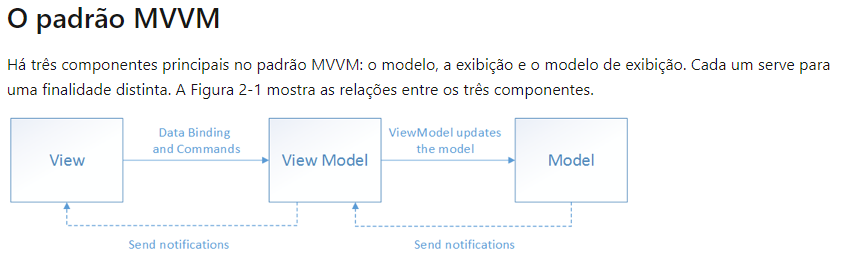

### Anotações Xamarin
(Anotações feitas com base na sessao 12 do curso de Xamarin.)  
[Saiba Mais](README.md)

## O projeto

O projeto sera um auxiliar para o jogo de mimica. Onde teremos um sistema que permitira cadastramento do nome do grupo, dificuldade da mimica, gerar palavras com base em um banco de dados para as pessoas adivinharem, um sistema de pontuação de acordo com a palavra gerada e um cronometro de tempo para cada rodada.   
[Saiba Mais](README.md)

## Estruturas usadas

- View Model (Classes CS): Diminuir o acoplamento das classes
- Model (Classes CS):  Colocar as informarções que teram em cada página.
- View (Classes XAML): Estrutura de cada página.

A utilização do View Model auxilia na separação correta da lógica de negócios e de apresentação de um aplicativo da interface do usuário. Ajuda a resolver inúmeros problemas de desenvolvimento e pode facilitar o teste, a manutenção e a evolução de um aplicativo. Tambem pode melhorar a reutilização de um código.

Relações enres os 3 componentes(View, View Model e Model).

### Benefícios de se usar o padrão MVVM
- Caso haja encapsulamento da lógica de negócios, pode ser difícil alterá-la. Usando MVVM o modelo de exibição atua como um adaptador para as classes de modelo e permite que evite fazer alterações importantes no código de modelo.
- Os desevolvedores podem criar teste de unidade para o modelo de exibição e o modelo, sem usar a exibição.
- A interface do usuário pode ser reformulada sem toca no código, desde que a exibição seja implementada inteiramente em XAML.
- Designers e Desenvolvedores podem trabalhar de maneira independente e simultânea em seus componentes durante o processo de desenvolvimento.

A melhor forma de se usar o MVVM está na compreensão de como fatorar o código do aplicativo nas classes corretas e no entendimento de como as classes se interagem.  
[Saiba Mais](README.md)

### Tipos de propriedade utilizadas
-  BindingContext: Propriedade obrigatoria para quem trabalha com vinculo de variáveis.

### Tipos de Estruturas utilizadas
- TimeSpan: Representa um intervalo de tempo. Seja ela a diferença de duas datas, o tempo decorrido ou a duração do tempo. Importante lembrar que não substitui a estrutura ["DateTime"](#Datetime)  
  [Saiba Mais](README.md)

### Interfaces usadas
- INotifyPropertyChanged:  
  Notifica seu "cliente" quando uma propriedade é alterada. Introduzida na versão 2.0 do .Net, a inteface proporciona um mecanismo para reunir em um único evento todos os eventos ["Changed"](#Changed) de um objeto.  
  [Saiba Mais](README.md)
- IValueConverter: 
  São denominados conversores de valor, mas também são conhecidas como conversores de assosiação ou conversores de valor de associação. Normalmente transferem dados de um propriedade de origem para uma propriedade de destino e, em alguns casos da propriedade de destino para a propriedade de origem.  
  [Saiba Mais](README.md)
### Menções

- #### Changed
  Permitem expressar ações declarativamente em XAML que alteram a aparência dos controles com base em eventos ou alterações de propriedade.   
  [Saiba Mais](README.md)

- #### DateTime
  Representa um momento no tempo, geralmente expresso como uma data e hora do dia. Valores variando de 00:00:00, 1º de janeiro de 0001 até 11:59:59 P.M., 31 dezembro,9999 ( Calendário gregoriano ).  
  [Saiba Mais](README.md)