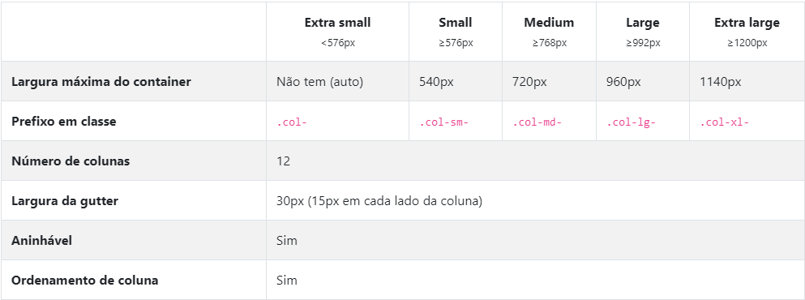
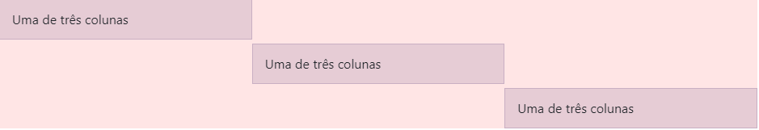
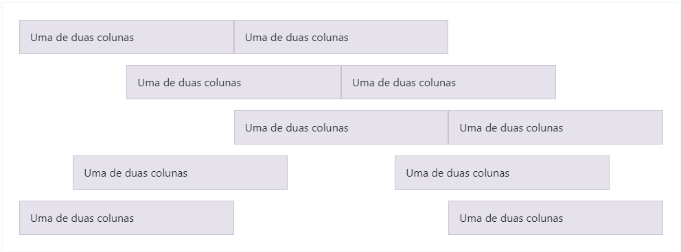
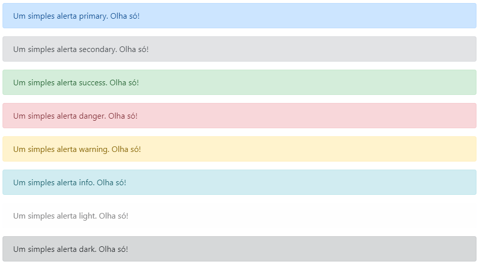

# Bootstrap

### O que é ?

- Bootstrap é o mas popular framework HTML,CSS e JS para desenvolvimento de projetos responsivos, ele é principalmente focado para trazer responsividade a dispositivos móveis na web.
- O Bootstrap torna o desenvolvimento Front-End Web mais rápido e fácil. Ele é feito para desenvolvedores de todos os níveis e se adapta a dispositivos de qualquer forma ou tamanho.

### Instalação:

É possível fazer a utilização do Bootstrap de duas forma, através de outros servidores da web, passando o link

- Via Link

  - Exemplo para instalação do css:

    ```HTML
    <head>
        <meta charset="UTF-8">
        <meta name="viewport" content="width=device-width, initial-scale=1.0, shrink-to-fit=no">
        <title>Instalação via CDN</title>
        <link href="https://maxcdn.bootstrapcdn.com/bootstrap/4.0.0-beta/css/bootstrap.min.css" rel="stylesheet" integrity="sha384-/Y6pD6FV/Vv2HJnA6t+vslU6fwYXjCFtcEpHbNJ0lyAFsXTsjBbfaDjzALeQsN6M" crossorigin="anonymous">
    </head>
    ```

    &emsp;no caso o link esta sendo passado pelo href.

  - Exemplo para instalação do js:

    ```HTML
    <body>
        <h1>Olá,mundo!</h1>
        <script src="https://maxcdn.bootstrapcdn.com/bootstrap/4.0.0-beta/js/bootstrap.min.js" integrity="sha384-h0AbiXch4ZDo7tp9hKZ4TsHbi047NrKGLO3SEJAg45jXxnGIfYzk4Si90RDIqNm1" crossorigin="anonymous"></script>
    </body>
    ```

  &emsp;no caso o link esta sendo passado pela tag script.

Ou passando o arquivo baixado, localizado em um documento local.

- Via Download
  - Exemplo para a instalação do css:
  ```HTML
   <head> <meta charset="UTF-8"> <meta name="viewport" content="width=device-width, initial-scale=1.0, shrink-to-fit=no"> <title>Instalação via CDN</title> <link href="css/bootstrap.min.css" rel="stylesheet" integrity="sha384-/Y6pD6FV/Vv2HJnA6t+vslU6fwYXjCFtcEpHbNJ0lyAFsXTsjBbfaDjzALeQsN6M" crossorigin="anonymous"> </head>
  ```
  - Exemplo para instalação do js:
  ```HTML
    <body>
        <h1>Olá,mundo!</h1>
        <script src="js/bootstrap.js" integrity="sha384-h0AbiXch4ZDo7tp9hKZ4TsHbi047NrKGLO3SEJAg45jXxnGIfYzk4Si90RDIqNm1" crossorigin="anonymous"></script>
    </body>
  ```
  O mesmo pode ser feito com arquivos [jQuery](README.md), [Popper](README.md) e etc. É importante lembrar que muitos componentes do Bootstrap necessitam dos arquivos Js de jQuery, Popper e dos próprios plugins JavaScript. Sendo necessário seguir uma ordem; jQuery em primeiro depois Popper.js e por ultimo os plugins JS e o Bootstrap.
  [Saiba Mais](README.md)

## Layout:

- [Containers](README.md): sendo os elementos mais básicos do Bootstrap são necessários quando usamos o sistema de grid padrão. Pode ser escolhido entre dois tipos de container;
  - Responsivo de largura fixa
  ```HTML
  <div class="container">
    <!--Escrever algo aqui-->
  </div>
  ```
  - Responsivo de largura fluida
  ```HTML
  <div class="container-fluid">
    <!--Escrever algo aqui-->
  </div>
  ```
- [Grid](README.md): Utiliza vários containers, para organizar o conteúdo. Utilizando o [flexbox](https://css-tricks.com/snippets/css/a-guide-to-flexbox/#flexbox-background) que o torna totalmente responsivo.
  Exemplo:

  ```HTML
  <div class="container">
    <div class="row">
        <div class="col-sm">
            Uma de três colunas
        </div>
        <div class="col-sm">
            Duas de três colunas
        </div>
        <div class="col-sm">
            Três de três colunas
        </div>
    </div>
  </div>
  ```

  O exemplo acima cria 3 larguras idênticas, usando grids pré-definidas. Tendo as colunas centralizadas na página pelo seu elemento pai "container".  
   Utiliza row para indicar as linhas da sua grid e col para indicar a coluna da grid. Cada linha possui no máximo 12 colunas, podendo definir seu tamanho usando .col-X onde X é o tamanho da sua coluna. Exemplo:

  ```HTML
  <div class="container">
    <div class="row">
        <div class="col-sm .col-4">
            Uma de três colunas
        </div>
        <div class="col-sm .col-8">
            Duas de três colunas
        </div>
    </div>
  </div>
  ```

  A primeira coluna do código acima ocupara apenas 4 espaços e o restante(8) esta na segunda coluna. Totalizando 12 espaços, caso esse número seja ultrapassado os espaços extras irão pular para a próxima linha.

  ### Outros parâmetros grid:

    
  Usando essas classes de breakpoints especificas é possível definir estilos específicos para quando a grid estiver um tamanho determinado.
  Exemplo:

  ```HTML
  <div class="container">
        <div class="row justify-content-md-center">
            <div class="col col-lg-2">
            1 de 3
            </div>
            <div class="col-md-4 col-xl-6">
                Conteúdo com largura variável
            </div>
            <div class="col col-lg-2">
                3 de 3
            </div>
        </div>
  </div>
  ```

  No código acima a coluna do meio terá seu tamanho variando de acordo com o tamanho da tela do dispositivo(tamanho da grid), sendo que ela ocupa 6 espaços em dispositivos grandes(com tela > 1200 pixels) e 4 espaços em dispositivos médios(com tela > 720 pixels).

  ### Alinhamento

  - Vertical:
    ```HTML
    <div class="container">
        <div class="row">
            <div class="col align-self-start">
                Uma de três colunas
            </div>
            <div class="col align-self-center">
                Uma de três colunas
            </div>
            <div class="col align-self-end">
                Uma de três colunas
            </div>
        </div>
    </div>
    ```
    
  - Horizontal:
    ```HTML
    <div class="container">
        <div class="row justify-content-start">
            <div class="col-4">
            Uma de duas colunas
            </div>
            <div class="col-4">
            Uma de duas colunas
            </div>
        </div>
        <div class="row justify-content-center">
            <div class="col-4">
            Uma de duas colunas
            </div>
            <div class="col-4">
            Uma de duas colunas
            </div>
        </div>
        <div class="row justify-content-end">
            <div class="col-4">
            Uma de duas colunas
            </div>
            <div class="col-4">
            Uma de duas colunas
            </div>
        </div>
        <div class="row justify-content-around">
            <div class="col-4">
            Uma de duas colunas
            </div>
            <div class="col-4">
            Uma de duas colunas
            </div>
        </div>
        <div class="row justify-content-between">
            <div class="col-4">
            Uma de duas colunas
            </div>
            <div class="col-4">
            Uma de duas colunas
            </div>
        </div>
    </div>
    ```
    

  # Reordenamento

  ## Classes de ordem:

  Usando classes ".order-" podemos controlar a ordem visual do conteúdo. Lembrando que é suportado apenas ate 12 espaços.

  ```HTML
  <div class="container">
  <div class="row">
      <div class="col">
      Primeiro, mas não está ordenado.
      </div>
      <div class="col order-12">
      Era o segundo, mas é o último ordenado.
      </div>
      <div class="col order-1">
      Era terceiro, mas é o primeiro ordenado.
      </div>
  </div>
  </div>
  ```

# Conteúdo

- ### Tipografias:
  O bootstrap possui uma tipografia bastante simples e de fácil personalização em títulos, texto corporativos, listas e etc.
  O framework define os estilos básicos de exibição e tipografia da seguinte forma:
  - Usar pilha de fonte nativas.
  - Incluir um fonte externa.
- ### Código
  É possível fazer blocos de código em Bootstrap basta usar a tag \<code>
- ### Imagens
  Usando a classe ".img-fluid" podemos tornar imagens responsivas. A também a opção de usar a classe ".img-thumbnail" que introduzira bordas arredondas na imagem  
  Outras classes existente para as imagens são as que nos permitem alinhar a imagem em relação ao nosso grid,usando:
  - float-left para alinhar a esquerda
  - float-right para alinhar a direita
  - mx-auto d-block para alinhar ao centro.
- ### Tabelas

  Para o uso de tabelas do Bootstrap basta adicionar a classe ".table" em uma tag \<table> do html. Para mais customização basta usar as outras diversas classes como:

  - .table-dark (inverter as cores da tabela)
  - .thead-light (Para fazer o thead mais claro)
  - .thead-dark (Para fazer o thead mais escuro)
  - .table-striped(Para adicionar linhas zebradas a um \<tbody>)
  - .table-bordered (Para adicionar borda em todos os lados da tabela)
  - .table-borderless (Para remover borda em todos os lados da tabela)
  - .table-sm (Reduzir pela metade o tamanho do espaçamento da tabela)

  Entre muitas outras classes que nos permite customizar nossa tabela.
  [Saiba mais](README.md)

# Componentes

- ## Alertas:

  Permite apresentar mensagens personalizadas para os usuário com base em suas ações. Exemplos de alert:

  ```HTML
  <div class="alert alert-primary" role="alert">
  Um simples alerta primary. Olha só!
  </div>
  <div class="alert alert-secondary" role="alert">
  Um simples alerta secondary. Olha só!
  </div>
  <div class="alert alert-success" role="alert">
  Um simples alerta success. Olha só!
  </div>
  <div class="alert alert-danger" role="alert">
  Um simples alerta danger. Olha só!
  </div>
  <div class="alert alert-warning" role="alert">
  Um simples alerta warning. Olha só!
  </div>
  <div class="alert alert-info" role="alert">
  Um simples alerta info. Olha só!
  </div>
  <div class="alert alert-light" role="alert">
  Um simples alerta light. Olha só!
  </div>
  <div class="alert alert-dark" role="alert">
  Um simples alerta dark. Olha só!
  </div>
  ```

  

- ### Badges:

  Um pequeno componente para contagem e rotulação, que escalam de acordo com o tamanho de seu elemento pai.
  Exemplos:

  ```HTML
  <h1>Cabeçalho exemplo <span class="badge badge-secondary">Novo</span></h1>
  ```

  

  Também podem ser usados para realizar contagem

  ```HTML
  <button type="button" class="btn btn-primary">
      Notificações <span class="badge badge-light">4</span>
  </button>
  ```

  

  Assim como os Alert tb possui customização

  ```HTML
  <span class="badge badge-primary">Primary</span>
  <span class="badge badge-secondary">Secondary</span>
  <span class="badge badge-success">Success</span>
  <span class="badge badge-danger">Danger</span>
  <span class="badge badge-warning">Warning</span>
  <span class="badge badge-info">Info</span>
  <span class="badge badge-light">Light</span>
  <span class="badge badge-dark">Dark</span>
  ```

  

- ### Botões:
  As classes em Bootstrap nos permite ter uma maior customização dos botões, e ainda com suporte a escolha de tamanhos, estados e etc.
  ```HTML
  <button type="button" class="btn btn-primary">Primary</button>
  <button type="button" class="btn btn-secondary">Secondary</button>
  <button type="button" class="btn btn-success">Success</button>
  <button type="button" class="btn btn-danger">Danger</button>
  <button type="button" class="btn btn-warning">Warning</button>
  <button type="button" class="btn btn-info">Info</button>
  <button type="button" class="btn btn-light">Light</button>
  <button type="button" class="btn btn-dark">Dark</button>
  <button type="button" class="btn btn-link">Link</button>
  ```
  
- ### Cards
  Proporcionam a nos containers de conteúdo flexível e extensível tendo opção para cabeçalhos e rodapés, cores de background contextuais e opções de display. Abaixo um exemplo de card simples.
  ```HTML
  <div class="row">
          <div class="col-12">
            <div class="card" style="width: 20rem;">
            <div class="card-body">                <h4 class="card-title">Titulo do Cartão </h4>
            <h6 class="card-subtitle text-muted mb-2">
                  Subtitulo do cartão</h6>
            <p class="card-text">Lorem Ipsum is simply dummy text of the printing and typesetting industry.
                Lorem Ipsum has been the industry's standard dummy text ever since the 1500s,
                when an unknown printer took a galley of type and scrambled it to make a type specimen book</p>
            <a class="card-link" href="#">Link do Cartão</a>
            <a class="card-link" href="#">Outro Link do Cartão</a>
          </div>
        </div>
      </div>
    </div>
  ```
  Também é possível colocar imagem nos card usando a classe "card-img-top" podendo também adicionar a localidade da imagem como no exemplo que a imagem estar na parte de cima do card ou até mesmo colocar o texto sob a imagem.